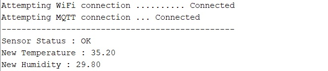
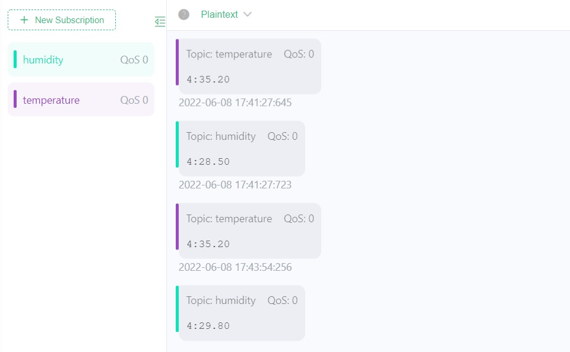

# NodeMCU Sensor

It's Arduino code for NodeMCU ESP8266 client. We have two branches:

1. **main :** MQTT
2. **prom :** Prometheus metrics

## How-to

1. Create your env file from `env.cpp.example` :

   ```cpp
   #include <Arduino.h>
   #include "env.h"

   String wifi_ssid = "your wifi ssid";
   String wifi_password = "your wifi password";
   const char* mqtt_server = "your mqtt server address ( without port number )";
   ```

2. Set your sensor's id in `NodeMCU-Sensor.ino` :

   ```cpp
   String sensor_id = "4";
   ```

3. Upload project to your device

## Result

The _temperature_ and _humidity_ values will read every 30 seconds ( You can change the interval ) and publish to MQTT server if there are significant changes in them.




